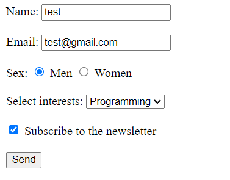
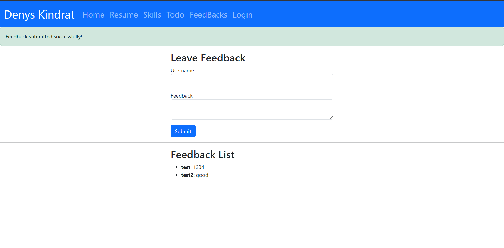

# Денис Кіндрат ІПЗ-31

---

## Список лабораторних робіт:
1. [Лабораторна №1](#lab1) 
2. [Лабораторна №2](#lab2) 
3. [Лабораторна №3](#lab3) 
4. [Лабораторна №4](#lab4) 
5. [Лабораторна №5](#lab5) 
6. [Лабораторна №6](#lab6) 
0. [Самостійна робота](#ind) 
7. [Лабораторна №7](#lab7) 
8. [Лабораторна №8](#lab8) 
9. [Лабораторна №9](#lab9) 

---

### Лабораторна №1
#### Завдання 1:
+ Створено звичаний ТСР сервер для обміну сповіщеннями з одним клієнтом

--- 

#### Скріншоти:
__Ex1_1__:

__Ex1_2__:

__Ex1_3-4__:

---
#### Завдання 2:
+ Створено звичайну багатопоточну чат-кімнату
---
__Ex2_1__:

__Ex2_2__:

[Вверх](#anchor)

---

### Лабораторна №2
#### Завдання 1_1:
+ Написати СGI-сценарій обробки форми
---
#### Скріншоти:

__Ex1_1-1__:

__Ex1_1-2__:

---

#### Завдання 1_2: 
+ Реалізувати cookies, зокрема має бути лічильник кількості заповнених форм користувачем. Також реалізуйте кнопку, яка видаляє всі cookies.
--- 

#### Скріншоти:

__1. Показ кількості заповння форми__:

__2. Видалення cookies__:

[Вверх](#anchor)

---

### Лабораторна №3
#### Завдання 1:
+ Створити базову сторінку за допомогою flask, скріншоти виконання завдання викладені нижче.

#### Скріншоти:

__1. Портфоліо__:

__2. Резюме__:

__3. Загальна сторінка з навичками__:

__4. Сторінка, коли вибрана одна навичка__:

[Вверх](#anchor)

---

### Лабораторна №4
#### Завдання 1:
+ Зробити рефакторинг проєкту

#### Скріншоти:

__1. Рефакторинг__:

__2. Логін__:

__3. Сторінка "info"__:

__4. Додавання cookies__:

__4. Зміна пароля через форму__:

[Вверх](#anchor)

---

### Лабораторна №5
#### Завдання:
+ Переробити форму для входу із попередньої лабораторної роботи, використовуючи WTF-форми + завдання додані комітом update.

#### Скріншоти:

__1. Футер тепер тільки на портфоліо__:

__2. Новий Логін__:

__3. Попередження щодо входу__:

__4. Успішний вхід без "remember me"(з теж працює і перекидає на "info")__:

__5. Додавання cookies(flash)__:

__6. Зміна пароля через форму(flash)__:

[Вверх](#anchor)

---

### Лабораторна №6
#### Завдання:
+ Розробити сторінку з інтерфейсом операцій CRUD щодо моделі Todo та добавити пункт “Todo” у меню проекту.

#### Скріншоти:

__1. Todo List__:

__2. База даних__:

__3. Додавання справи в Todo List__:

__4. База даних після додавання справи__:

__5. Сторінка зміни справи(Edit Todo)__:

__6. Видалення справи з Todo List__:

[Вверх](#anchor)

---

### Самостійна робота
#### Завдання:
+ Додати до існуючого проекту форму відгуку, що залишають користувачі. Дані зберігати у базі даних. Cигналізувати про успішні чи не успішні дії flash-повідомленнями. На тій же самій сторінці, що форма, відобразити всі залишені відгуки. Використати WTF-форми і ORM Flask-SQLAlchemy

#### Скріншоти:

__1. Feedback Page__:

__2. Успішне додавання відгуку__:

__3. База даних feedback__:

[Вверх](#anchor)

---

### Лабораторна №7
#### Завдання 1:
+ Побудувати модель user і переробити login під базу даних, також реалізувати реєстрацію на сайті

#### Скріншоти:

__1. Оновлена сторінка Login__:

__2. Сторінка Register__:

__3. Успішна реєстрація і вхід користувача(user3)__:

__4. Пароль User1 був зарєстрований до встановлення хешування паролю, ось БД__:

__5. Сторінка Users__:

__6. Помилка при використання наявних даних в БД при реєстрації__:

__7. Помилка при вході(введені дані яких немає в БД)__:

[Вверх](#anchor)

---

### Лабораторна №8
#### Завдання 1:
+ Управління сеансами користувачів для зареєстрованих
користувачів.Flask-Login

#### Скріншоти:

__1. Успішних вхід__:

__2. Успішних вихід__:

__3. Якщо користувач не увійшов і хоче зайти на сторінки Users або Info, видає ось таке__:

__4. Сторінка My Account після входу__:

[Вверх](#anchor)

---

### Лабораторна №9
#### Завдання 1:
+ Створити нове оновлення профілю

#### Скріншоти:

__1. Новий Профіль Користувача__:

__2. Форма зміни даних на аккаунті__:

__3. Зміна даних на аккаунті(логіка зміни фото теж прописана, але я так і не зміг розібратися у чому проблема і воно не переписує його у БД)__:

__4. Помилка при використанні пошти яка уже використовується__:

[Вверх](#anchor)